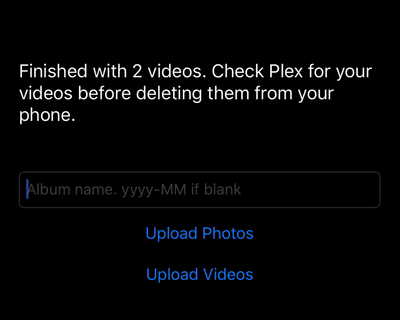

# Sumu Backup
Back up photos and videos to your own server instead of iCloud!

## What is this?
A minimalist iOS app and Flask web server. The app uploads all photos, videos, live photos, slow-mo videos, etc. from your phone to the web server, which stuffs metadata into a database and stores the assets on disk so they can be browsed with e.g. Plex.

## Usage
TLDR: run the web server in `backend/` on your server, build this app onto your phone with XCode, and tap Upload Photos or Upload Videos to start.

Download Xcode and open this project in it. If you haven't made an iOS app before, you'll have to do some configuration. This [Apple tutorial](https://developer.apple.com/library/archive/referencelibrary/GettingStarted/DevelopiOSAppsSwift/) is a good place to start. Change `SERVER` in `Constants.swift` to point at your backup server; if your server is on the same LAN, you can just use its human-readable local DNS name.
